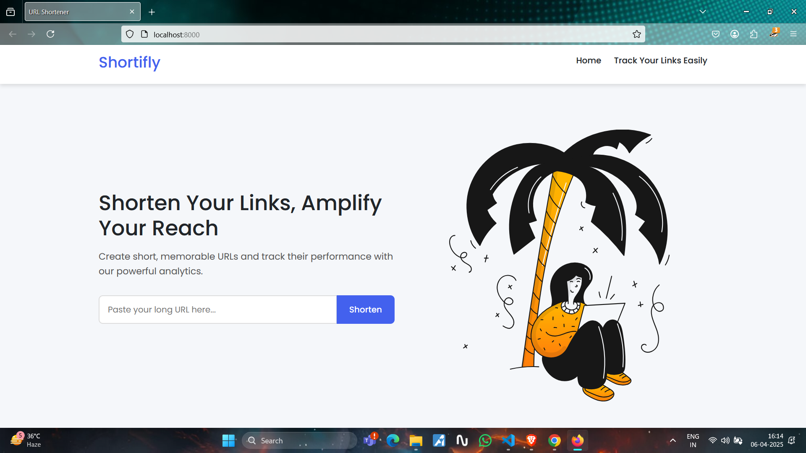
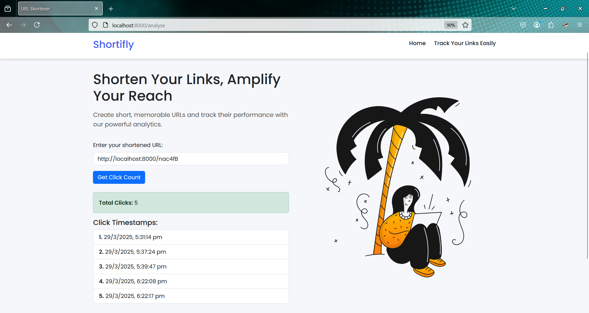

# 🔗 Shortifly - URL Shortener & Analytics Web App


> A simple and powerful URL shortener built with Node.js, Express, MongoDB, and EJS. Generate clean short URLs and track click analytics in real-time.

---

## 📸 Preview

### 🏠 Home Page Demo  



---

### 🔗 Short Link Creation Demo  


---

### 📊 Track Links Page Demo  



---

## ✨ Features

- 🔗 Shorten long URLs into concise links
- 📈 View total click counts for each link
- 🕒 Timestamp log of all visits
- 📋 Copy button for quick sharing
- ⚙️ Built with Express and MongoDB
- 📂 Clean project structure and modular codebase

---

## 🛠️ Tech Stack

- **Backend:** Node.js, Express.js
- **Database:** MongoDB, Mongoose
- **Templating Engine:** EJS
- **Styling:** CSS3, Bootstrap 5
- **Other Tools:** dotenv, ShortUniqueId

---

## 📁 Project Structure

<pre>

Shortifly/
├── assets/                 # Media assets (images for documentation/screenshots)
│   ├── homepage.png        # Screenshot of the homepage
│   ├── totallinks.png      # Screenshot showing total links or clicks
│   └── tracklinks.png      # Screenshot of the analytics/tracking page
├── controller/             # Logic for handling application control flow
│   └── control.js          # Core controller logic
├── models/                 # Mongoose schemas and database models
│   └── schema.js           # URL schema definition
├── public/                 # Static assets (CSS, JS, etc.)
│   └── styles.css          # Main stylesheet
├── routes/                 # Route definitions for the application
│   └── route.js            # All route handlers
├── views/                  # EJS templates for rendering frontend pages
│   ├── layout/             # Layout partials for EJS views
│   │   ├── header.ejs      # Header partial
│   │   └── footer.ejs      # Footer partial
│   ├── index.ejs           # Home page view
│   └── analyse.ejs         # Analytics page view
├── .env                    # Environment variables file
├── app.js                  # Main server file (Express setup)
├── package.json            # Project metadata and dependencies
└── README.md               # Project documentation
</pre>


---

## 🧑‍💻 Getting Started

### Prerequisites

Make sure you have the following installed:

- Node.js & npm: [https://nodejs.org](https://nodejs.org)
- MongoDB: [https://www.mongodb.com](https://www.mongodb.com)

### Clone and Run Locally

```bash
# 1. Clone the repo
git clone https://github.com/Abhii26/Shortifly.git
cd Shortifly

# 2. Install dependencies
npm install

# 3. Set up environment variables
# Create a .env file in the root directory
touch .env
MONGODB_URL=your_mongodb_connection_string

# 4. Start the server
node app.js

The app will run at http://localhost:8000

📋 Usage
Visit the homepage to enter a URL and generate a short link.

Copy and share the short link.

Use the Analytics page to check total clicks and view timestamps for any short URL.

🚧 Future Enhancements
🔐 User login and dashboard

✏️ Custom short link aliases

📊 Graph-based click analytics

🗑️ Link expiration options

🤝 Contributing
Contributions are welcome!
Fork the repo, create a feature branch, and open a pull request.

📜 License
Licensed under the MIT License.

👨‍💻 Author
Abhishek Tiwari
🔗 GitHub

“Shorten smarter. Track better. Share faster.”

