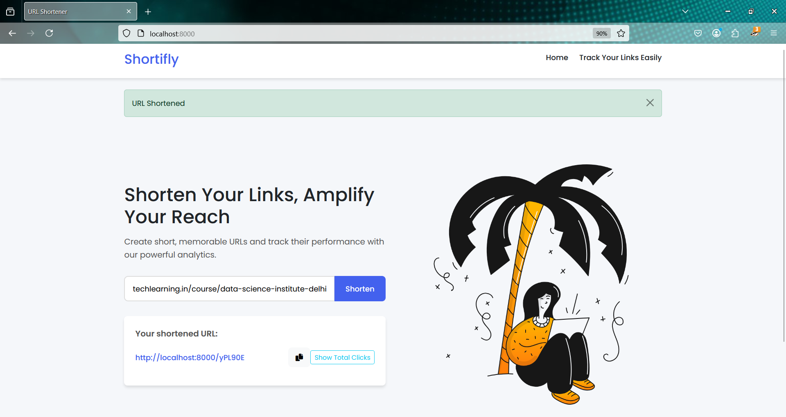

# 🔗 Shortifly - URL Shortener & Analytics Web App


> A simple and powerful URL shortener built with Node.js, Express, MongoDB, and EJS. Generate clean short URLs and track click analytics in real-time.

---

## 📸 Preview




---

## ✨ Features

- 🔗 Shorten long URLs into concise links
- 📈 View total click counts for each link
- 🕒 Timestamp log of all visits
- 📋 Copy button for quick sharing
- ⚙️ Built with Express and MongoDB
- 📂 Clean project structure and modular codebase

---

## 🛠️ Tech Stack

- **Backend:** Node.js, Express.js
- **Database:** MongoDB, Mongoose
- **Templating Engine:** EJS
- **Styling:** CSS3, Bootstrap 5
- **Other Tools:** dotenv, ShortUniqueId

---

## 📁 Project Structure

Shortifly/
├── assets/              # Folder for images
│   ├── homepage.png    # Screenshot of the homepage
│   ├── totallinks.png  # Screenshot of the analytics page
│   ├── tracklinks.png   # Screenshot showing link shorten
├── controller/
│   └── control.js
├── models/
│   └── schema.js
├── public/
│   └── styles.css
├── routes/
│   └── route.js
├── views/
│   ├── index.ejs
│   └── analyse.ejs
├── .env
├── app.js
├── package.json
└── README.md
---

## 🧑‍💻 Getting Started

### Prerequisites

Make sure you have the following installed:

- Node.js & npm: [https://nodejs.org](https://nodejs.org)
- MongoDB: [https://www.mongodb.com](https://www.mongodb.com)

### Clone and Run Locally

```bash
# 1. Clone the repo
git clone https://github.com/Abhii26/Shortifly.git
cd Shortifly

# 2. Install dependencies
npm install

# 3. Set up environment variables
# Create a .env file in the root directory
touch .env
MONGODB_URL=your_mongodb_connection_string

# 4. Start the server
node app.js

The app will run at http://localhost:8000

📋 Usage
Visit the homepage to enter a URL and generate a short link.

Copy and share the short link.

Use the Analytics page to check total clicks and view timestamps for any short URL.

🚧 Future Enhancements
🔐 User login and dashboard

✏️ Custom short link aliases

📊 Graph-based click analytics

🗑️ Link expiration options

🤝 Contributing
Contributions are welcome!
Fork the repo, create a feature branch, and open a pull request.

📜 License
Licensed under the MIT License.

👨‍💻 Author
Abhishek Tiwari
🔗 GitHub

“Shorten smarter. Track better. Share faster.”

